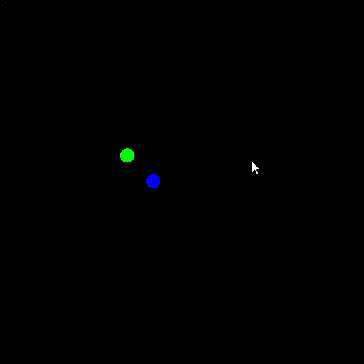

# Bohr's Model Simulation

Simulates electron orbiting a nucleus using Coulomb's force and circular motion.

## Physics
- Coulomb's Law: F = kq1q2/r²
- Orbital velocity: v = e√(k/mr)
- Direct position update via angle accumulation

## Built With
- C++
- SFML

## Demo
- 