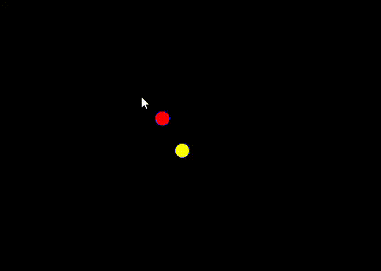

# Magnetism

Simulates two charged particles placed close to each other. One is fixed and user can use arrow keys to move the second charged particle

## Physics
- Biot-Savart Law: B = kI/r*r

## Built With
- C++
- SFML

## Demo
- 