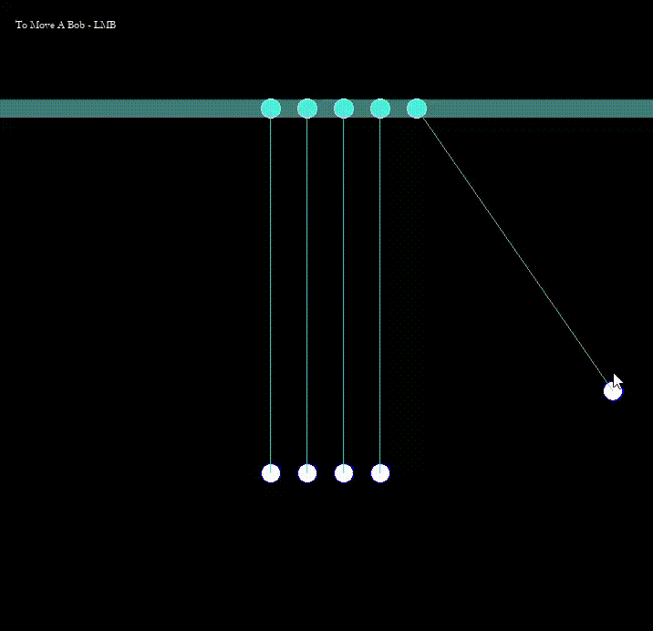

# Newton's Cradles

Simulates 5 pendulums that are placed closed to each other. When one strucks other, the momentum is transferred in a chain

## Physics
- Collision Physics
- Ball to Ball Collision
- String constraint

## Built With
- C++
- SFML

## Demo
- 