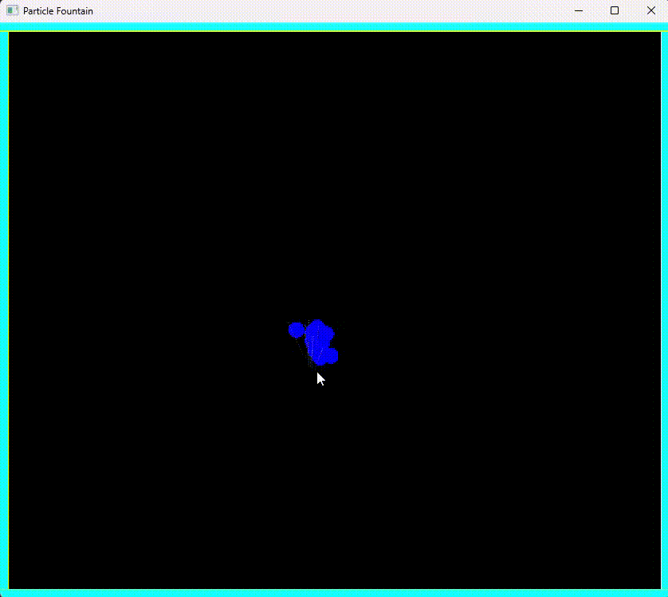

# Magnetism

Simulates 10 physics particles that can be spawned by a left click. The balls gain random velocities and act against gravity. When they are spawned, it seems like it is a fountain. After few seconds, the oldest of them starts to disappear.

## Physics
- Wall collision
- Gravity

## Built With
- C++
- SFML

## Demo
- 