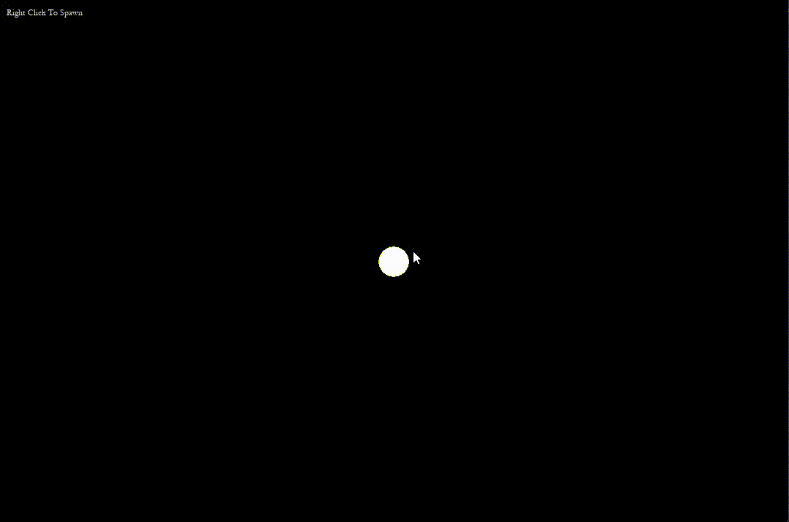

# Rigid Body Solar System

A real-time 2D physics simulation in C++ and SFML. Spawn rectangles that enter orbit around a gravitational sun, collide with each other using SAT collision detection, and fragment on impact.

 

---

## Demo

> Spawn planets by clicking. They enter circular orbit, collide with angular impulse response, and break apart when they hit the sun.



---

## Features

- **Orbital mechanics** — gravitational attraction using Newton's law of gravitation; spawn velocity is computed from the circular orbit formula `v = sqrt(GM/r)` so planets orbit immediately on spawn
- **SAT collision detection** — Separating Axis Theorem on arbitrarily rotated rectangles with proper world-space vertex projection
- **Rigid body impulse resolution** — angular and linear impulse response at the correct contact point, accounting for rotational inertia
- **Fragmentation** — planets that hit the sun break into smaller physics bodies that orbit and decay independently
- **N-body gravity** — all bodies exert gravitational pull on each other, not just on the sun

---

## Controls

| Input | Action |
|---|---|
| Left click | Spawn orbiting rectangle planet |

---

## Building

### Requirements

- C++17 or later
- [SFML 3.1.0](https://www.sfml-dev.org/download/)
- MinGW64 g++ 14.2.0 (Windows) or equivalent

### Compile

```bash
g++ main.cpp -o sim -IC:/SFML/include -LC:/SFML/lib -lsfml-graphics -lsfml-window -lsfml-system
```

Adjust the include and lib paths to match your SFML install location.

---

## Project Structure

```
├── main.cpp          # Simulation loop, spawning, gravity, rendering
├── RigidBody.cpp     # RigidBody struct, Euler integration, force accumulation
├── Vec2.h            # 2D vector math (dot, cross, rotate, normalize)
```

---

## Physics Notes

### Orbital velocity

At spawn, each planet's velocity is set perpendicular to the sun-planet vector with magnitude `sqrt(G*M/r)`. This produces a circular orbit at the spawn distance assuming no other bodies interfere.

### SAT collision

For each pair of rectangles, face normals from both bodies (4 axes total) are tested. The axis with minimum overlap is the collision normal. World-space vertices are computed each frame from local vertices rotated and translated by each body's current `theta` and `position`.

### Impulse resolution

Contact points are found by projecting world-space vertices onto the collision normal and taking the deepest-penetrating vertex from each body. The impulse magnitude accounts for both linear and rotational inertia:

```
impulse = -(1 + e) * v_rel / (1/mA + 1/mB + (rA×n)²/IA + (rB×n)²/IB)
```

---

## What I Learned

Built this progressively from a single bouncing rectangle up to a full N-body orbital sim with collision response. Key concepts worked through from scratch:

- Euler integration and force accumulation
- Coordinate system flipping (SFML Y-down vs physics Y-up)
- SAT with rotated polygons and world-space projection
- Impulse-based rigid body collision with angular response
- Reference invalidation bugs from modifying `std::vector` during iteration
